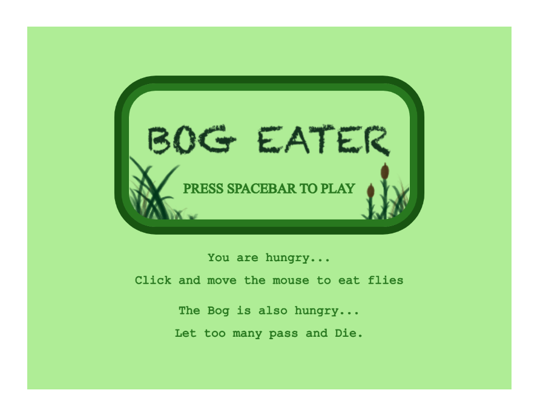
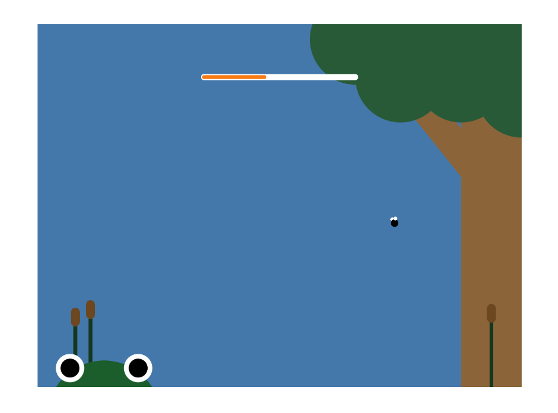
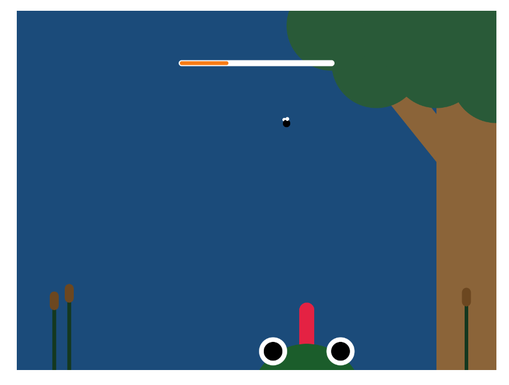
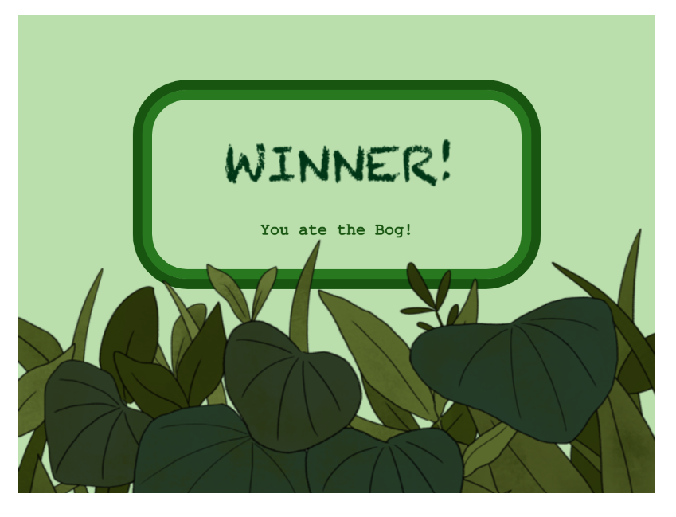
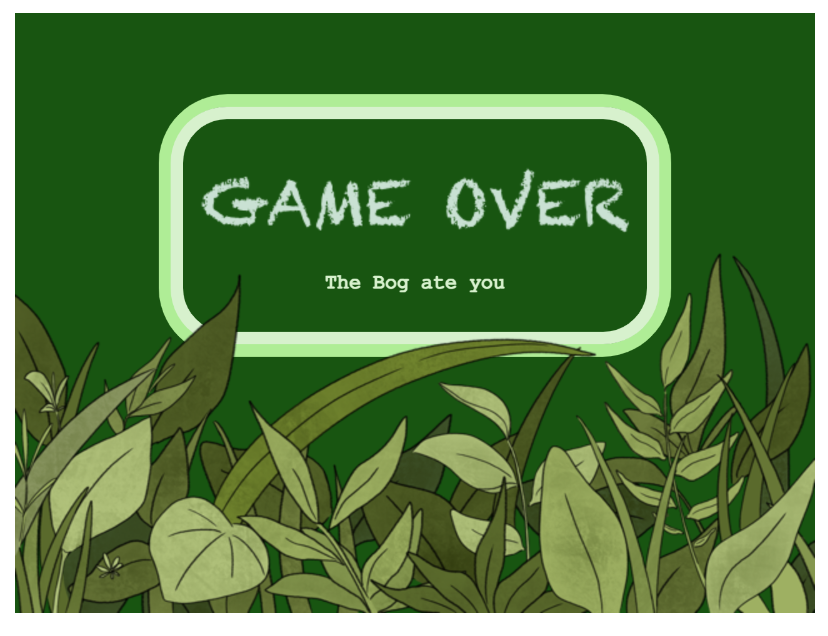

# BOG EATER

Chloé Guérin

[View this project online](URL_FOR_THE_RUNNING_PROJECT)

## Description

BOG EATER is a game where you, a frog, is very very hungry. 

> Press spacebar to start the game, click the mouse to launch your tongue and try to cath as many flies as possible to satiate your hunger. 

> Your body follows the mouse, and if you miss too many flies you will starve to death and become part of the bog's ecosystem.

> If you wish to test your skills again, Ctrl+R to restart the game.

> This game is meant to give the understanding of eat or be eaten and the brutal battle of survival in the wild.

## Screenshot(s)

> 
> 
> 
> 
> 

## Attribution

This bit should attribute any code, assets or other elements used taken from other sources. For example:

> - This project uses [p5.js](https://p5js.org).
> - The clown image is a capture of the clown from the Apple emoji character set.
> - The barking sound effect is "single dog bark 1" by crazymonke9 from freesound.org: https://freesound.org/people/crazymonke9/sounds/418107/

## License

> This project is licensed under a Creative Commons Attribution ([CC BY 4.0](https://creativecommons.org/licenses/by/4.0/deed.en)) license with the exception of libraries and other components with their own licenses.

> This project was made for a school project for the CART253 class.