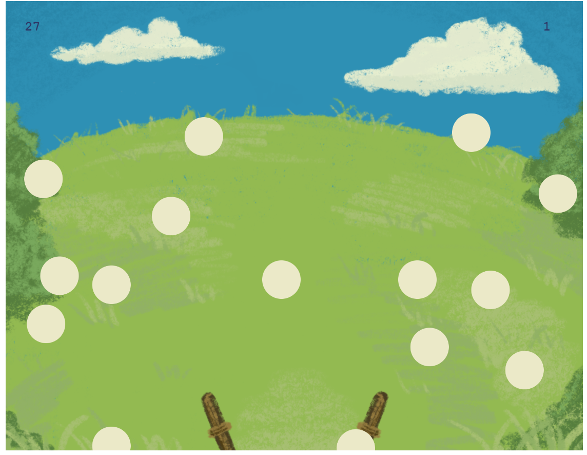
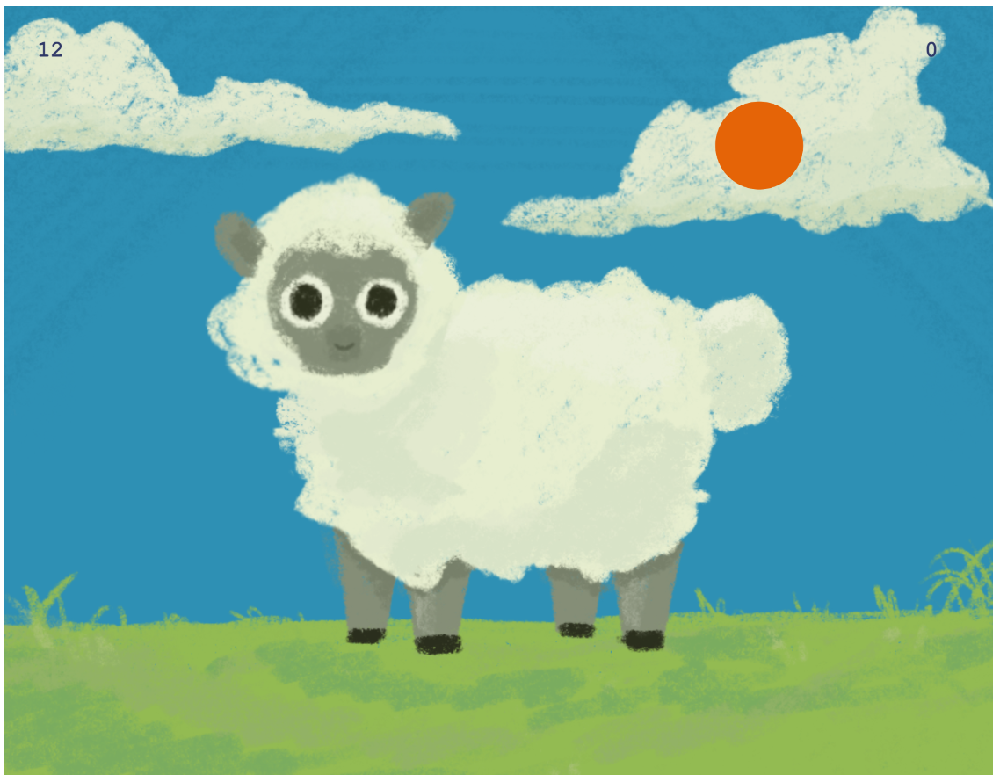

# KEEPER OF SHEEP

Chloé Guérin

[View this project online](https://chloe-jpeg.github.io/CART253/VARIATION-JAM/)

## Description

The pastures are green, the sun is shining, life is good. But you know what would make it better? SHEEP! This game was made to give people an idea of what it would be like to catch, feed and protect sheep. Totally based on reality and guaranteed to give you basic skills in sheepkeeping or we give you all your money back! 

To maximize your learning, 3 mini-games are offered to you, the first one is to catch wild sheep, the second to feed and care for them, and the third to protect them from the wild beasts of the night. 

The games are played using your mouse to herd or push away what is needed. If you manage all 3, it is strongly encouraged to abandon everything in your life and run to the hills where you can use your hard earned experience onto the real thing.
*We are not responsible for possible maiming and general injuries that could come from the realities of this lifestyle.*

## Screenshot(s)

This bit should have some images of the program running so that the reader has a sense of what it looks like. For example:

> 
> 
> 
> 

## Attribution

This bit should attribute any code, assets or other elements used taken from other sources. For example:

> - This project uses [p5.js](https://p5js.org).
> - This project also uses [W2school](https://www.w3schools.com/)
> - Backgrounds and assets made by me using procreate
> - Like always, special thanks to my Dad for your help on the score issue, I'll buy you a big KitKat
> - And thank you Pippin for the menu template & classmates for the menu help!

## License
> This project is licensed under a Creative Commons Attribution ([CC BY 4.0](https://creativecommons.org/licenses/by/4.0/deed.en)) license with the exception of libraries and other components with their own licenses.